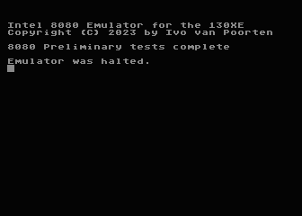
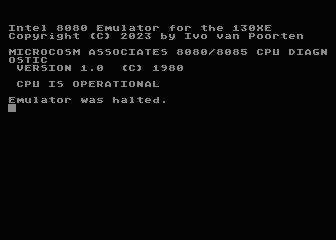
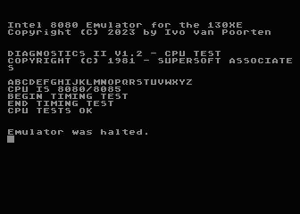
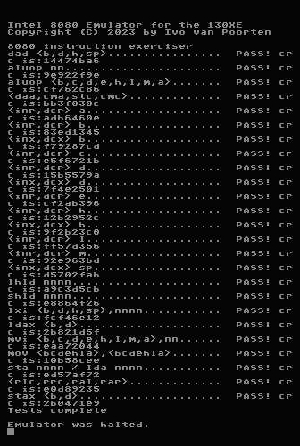

### Intel 8080 Emulator

This repository contains two Intel 8080 emulators. One was written in C
with the idea in mind to eventually implement the same virtual machine
in 6502 assembly. If you look at its source code, you'll find lots of
ponderings and comments on how to efficiently implement it in assembly.
I also mimics the 16kB extended memory banking of the Atari 130XE.

The second version is the actual 6502 implementation. Currently it runs
on the Atari 130XE and has a minimal BIOS implementation to run just enough
of CP/M BDOS to output diagnostic messages to the screen. Future plans are
to run it on top of CP/M-65 that will take care of all BIOS and BDOS
functionality.

The C version has a complete BIOS (minus list, reader and punch)
implementation that is capable of running vanilla CP/M 2.2.
Terminal handling is done in raw mode, so control
characters work like expected. Ctrl-X exits the emulator.
The emulated disk is an IBM 3740 but without sector skew. Eventually it'll
run off an Atari drive or a simulated peripheral (SIO2SD, SIDE).  

#### Test suites

All four tests with the 6502 core are succesful!

   
   


The 8080 core runs all validation sets correctly. Output:

```
$ ./atari8080 bootdisk.img 

64k CP/M vers 2.2

A>tst8080
MICROCOSM ASSOCIATES 8080/8085 CPU DIAGNOSTIC
 VERSION 1.0  (C) 1980

 CPU IS OPERATIONAL
A>cputest

DIAGNOSTICS II V1.2 - CPU TEST
COPYRIGHT (C) 1981 - SUPERSOFT ASSOCIATES

ABCDEFGHIJKLMNOPQRSTUVWXYZ
CPU IS 8080/8085
BEGIN TIMING TEST
END TIMING TEST
CPU TESTS OK

A>8080pre
8080 Preliminary tests complete
A>8080exm
8080exm
8080 instruction exerciser
dad <b,d,h,sp>................  PASS! crc is:14474ba6
aluop nn......................  PASS! crc is:9e922f9e
aluop <b,c,d,e,h,l,m,a>.......  PASS! crc is:cf762c86
<daa,cma,stc,cmc>.............  PASS! crc is:bb3f030c
<inr,dcr> a...................  PASS! crc is:adb6460e
<inr,dcr> b...................  PASS! crc is:83ed1345
<inx,dcx> b...................  PASS! crc is:f79287cd
<inr,dcr> c...................  PASS! crc is:e5f6721b
<inr,dcr> d...................  PASS! crc is:15b5579a
<inx,dcx> d...................  PASS! crc is:7f4e2501
<inr,dcr> e...................  PASS! crc is:cf2ab396
<inr,dcr> h...................  PASS! crc is:12b2952c
<inx,dcx> h...................  PASS! crc is:9f2b23c0
<inr,dcr> l...................  PASS! crc is:ff57d356
<inr,dcr> m...................  PASS! crc is:92e963bd
<inx,dcx> sp..................  PASS! crc is:d5702fab
lhld nnnn.....................  PASS! crc is:a9c3d5cb
shld nnnn.....................  PASS! crc is:e8864f26
lxi <b,d,h,sp>,nnnn...........  PASS! crc is:fcf46e12
ldax <b,d>....................  PASS! crc is:2b821d5f
mvi <b,c,d,e,h,l,m,a>,nn......  PASS! crc is:eaa72044
mov <bcdehla>,<bcdehla>.......  PASS! crc is:10b58cee
sta nnnn / lda nnnn...........  PASS! crc is:ed57af72
<rlc,rrc,ral,rar>.............  PASS! crc is:e0d89235
stax <b,d>....................  PASS! crc is:2b0471e9
Tests complete
A>dir
A: STAT     COM : DUMP     COM : PIP      COM : 8080EXM  COM
A: 8080PRE  COM : CPUTEST  COM : TST8080  COM
A>stat dsk:

    A: Drive Characteristics
 1944: 128 Byte Record Capacity
  243: Kilobyte Drive  Capacity
   64: 32  Byte Directory Entries
   64: Checked  Directory Entries
  128: Records/ Extent
    8: Records/ Block
   26: Sectors/ Track
    2: Reserved Tracks

A>
```

Copyright © 2023 by Ivo van Poorten, see LICENSE for details.
